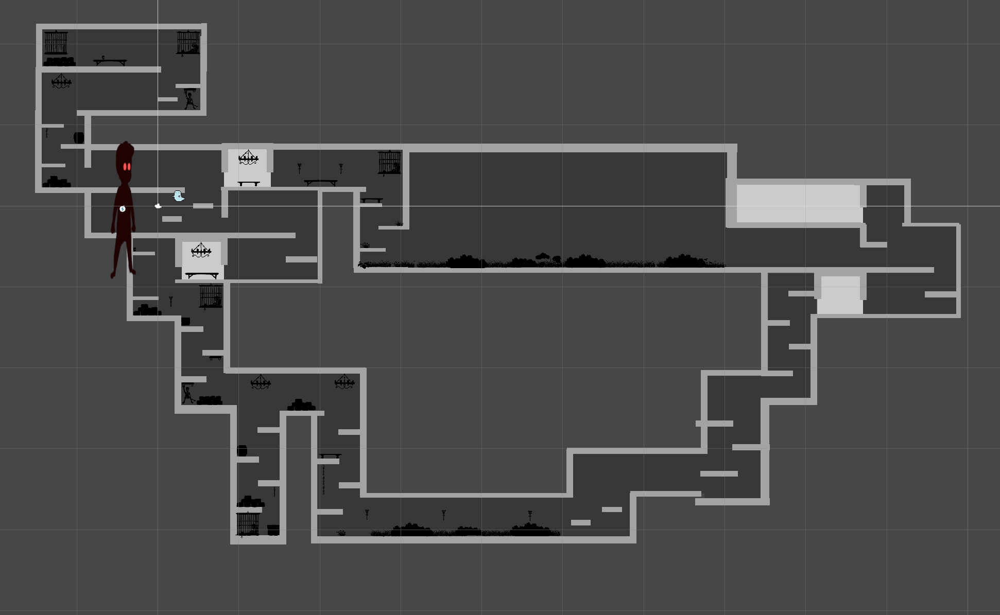

# gdtvgamejam23

# GamedevTV GameJam for 19-29 May of 2023! 
**THEME: Life in 2 dimensions!**

# USEFUL LINKS
[**Game Jam URL**](https://itch.io/jam/gamedevtv-jam-2023)

[**Twitch**](https://www.twitch.tv/gamedevtv)

[**Our Game on Itch.io**](https://elfpenguin.itch.io/dimensional-dreamcatcher)

[**Game on GitHub Pages**](https://rubenftgd.github.io/gdtvgamejam23/)

# CONTROLS
**Space** - Jump

**A/D or Left and Right Keys** - Move Left/Right

**E** - Change Your Dimention from Real World to Dream/Nightmare World

---

# Credits
## Artist:
* [Alican Bagbek](http://artstation.com/alicanbagbekart)

## Pixel Art:
* [Rúben Tadeia](https://elfpenguin.itch.io/)

## Programming:
* [Rúben Tadeia](https://elfpenguin.itch.io/)
* [leotray](https://itch.io/profile/leotray)

## Game Design:
* [awesomeaj5](https://ajort5.itch.io/)
* [smithperfect](https://jstory.itch.io/)

---

**Early Stages of Development**
======

**AI following** 

**Moonwalking Ghosts** 

**Title** 

**Title White** 

**Title0 Grey** 

---

**Aseprite**
======

**Name** 

**Door** 

**Key** 

**Ghost-Idle** 

**Ghost-Angry** 

---

**General**
======

**Characters on Forest** 

**Game Background** 

**Map** 

**Monsters And Characters** 

**Death** 

**The End** 

---

**Character**
======

**Character Idle** 

**Run N Gun Sprite** 

**Character Run Sprite** 

**Character Run Parts** 

**Character Weapon Idle** 

**Character Throw Run Sprite** 

**Character Throw Idle** 

**Character Run Throw Anim Parts**

**Character Shootnrun Anim**

**Ghost Capturer** 

**Electro-Ball** 

**Explosion 1** 

**Explosion 2** 

**Laser 1** 

**Laser 2** 

**Laser 3** 

**Laser Lense** 

**Weapon Effect** 

**Bomb** 

---

**Dungeon Assets**
======

**Barrel** 

**Cage 1**

**Cage 2** 

**Chain 1** 

**Chain 2**

**Chandelier** 

**Crate 1**

**Crate 2**

**Platform 1**

**Platform 2**

**Rock 1** 

**Rock 2** 

**Rock 3** 

**Rock Tile 1** 

**Rock Tile 2** 

**Skull 1** 

**Skull 2** 

**Skull 3** 

**Torch** 

**Wall Cuff 1** 

**Wall Cuff 2** 

---

**Forest Assets**
======

**Branch** 

**Bush 1** 

**Bush 2** 

**Bush 3** 

**Grass 1** 

**Grass 2** 

**Grass 3** 

**Plant 1** 

**Plant 2** 

**Plant 3** 

**Plant 4** 

**Platform and Bush 1**  

**Platform and Bush 2** 

**Rock** 

---

**Monsters**
======

**Banshee** 

**Big Ghost** 

**Centipede** 

**Scorpion** 

**Small Ghost** 

**Snake** 

**Spider** 

